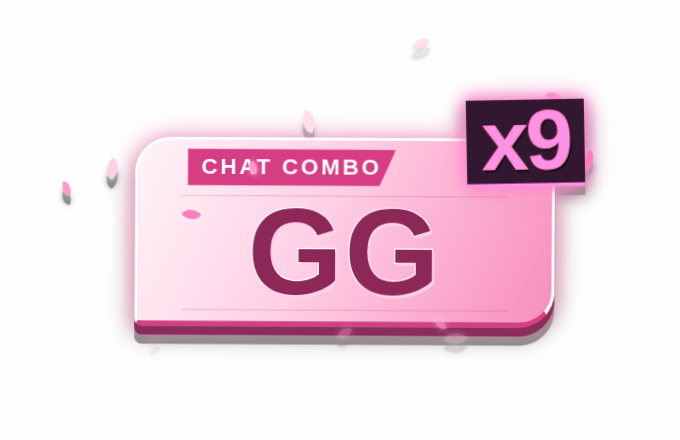
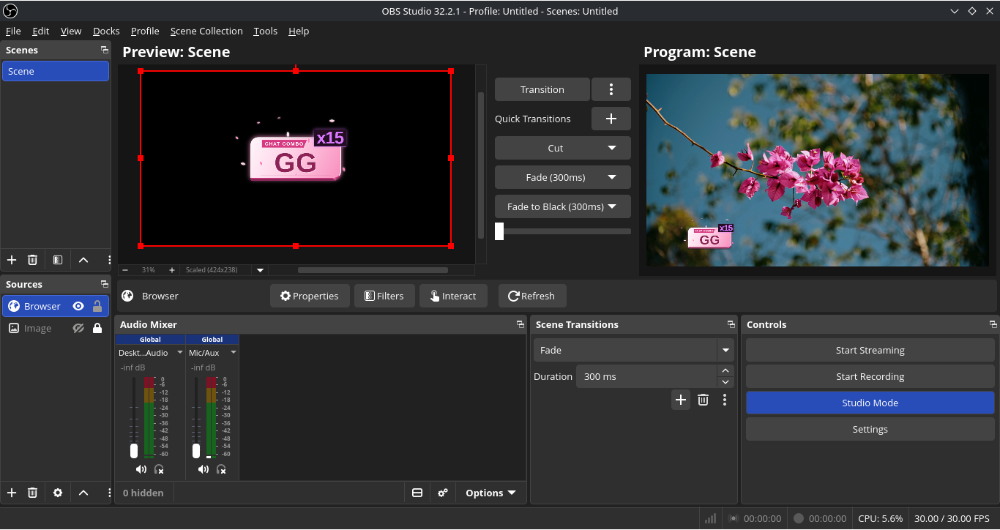
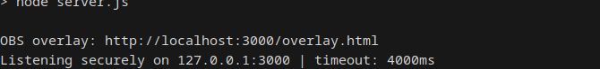

# Twitch Chat Combo Overlay

A local Twitch chat overlay for OBS that turns repeated chat messages into an animated combo counter. It watches one channel, detects matching messages, and shows the newest active repeat chain in a transparent browser source. Nothing needs to be hosted: the server, Control Room, overlay, and settings all run on your own computer.

## What it looks like

### Control Room

Choose a theme, combo timeout, and the repeat count that should first appear on-screen. Changes are saved locally and update every open overlay immediately.


### Sakura overlay preview

The overlay itself has a transparent background, so it can sit on top of your stream scene.



### In OBS

Use the overlay as a Browser source in the same OBS scene as your camera, game, or background.



## Requirements

- [Node.js](https://nodejs.org/) 18 or newer.
- OBS Studio if you want to use the overlay in a stream.
- A Twitch channel name. Anonymous, read-only chat access is the default; a bot account is optional.

## Setup on Linux

These are the steps used for the current Linux workflow.

1. Open a terminal in the project folder.
2. Create your private configuration file from the example:

   ```bash
   cp .env.example .env
   ```

3. Open `.env` in an editor and set `TWITCH_CHANNEL` to the channel to watch, without `#`.
4. Install the app's dependencies:

   ```bash
   npm install
   ```

5. Start the local server:

   ```bash
   npm start
   ```

6. Keep that terminal open while using the overlay. A successful start prints the local overlay URL.

### Successful startup

The app prints its local overlay address and confirms that it is listening on the private local address.



## Setup on Windows (untested)

The application uses standard Node.js and OBS features, but this exact workflow has not been tested on Windows.

1. Install Node.js 18 or newer and OBS Studio.
2. Open PowerShell or Command Prompt in the project folder.
3. Make a copy of `.env.example` named `.env`, then edit it and set `TWITCH_CHANNEL`.
4. Run:

   ```powershell
   npm install
   npm start
   ```

5. Leave the window running. Open `http://localhost:3000/settings.html` in your browser.

If port 3000 is already in use, change `PORT` in `.env`, restart the app, and use that same port everywhere below.

## Configure `.env`

`.env` is private and is ignored by Git. Never commit, paste, or share it if it contains a token.

```dotenv
# Required: channel name, without the #
TWITCH_CHANNEL=your_channel_name

# Optional: leave both blank for anonymous read-only chat access
TWITCH_BOT_USERNAME=
TWITCH_OAUTH_TOKEN=

# Local server settings
PORT=3000
HOST=127.0.0.1

# Defaults used until the Control Room saves its own choices
COMBO_TIMEOUT_MS=6500
MIN_COMBO_COUNT=2
```

`HOST=127.0.0.1` keeps the app accessible only from this computer, which is the recommended setting for a local OBS setup.

## Control Room and browser preview

With `npm start` still running:

1. Open `http://localhost:3000/settings.html` in a normal browser.
2. Select a theme: **Game**, **Sakura**, **Rainfall**, **Inferno**, or **Luna**.
3. Adjust **Combo timeout** and **Show starting at** as desired. The chosen values save locally in `settings.json` and take effect right away.
4. To see a scripted animation without waiting for chat, open `http://localhost:3000/overlay.html?preview=1`.

The preview cycles a sample `GG` combo from x2 through x15, pauses, then plays the selected theme's exit animation. Remove `?preview=1` before going live; the normal overlay URL only reacts to real chat events.

## Add it to OBS

1. In OBS, add a **Browser** source to the scene.
2. Set its URL to:

   ```text
   http://localhost:3000/overlay.html
   ```

3. Set the Browser source width and height to match the scene or canvas, for example `1920` by `1080`.
4. Place the source above the game, camera, or background sources.
5. Use **Refresh** in the Browser source properties after restarting the Node server if OBS does not reconnect automatically.

The page background is transparent. OBS and this application must run on the same computer when using the default private `127.0.0.1` address.

## Test repeated messages

1. Start the app and leave the OBS Browser source open.
2. Send the same message in the configured Twitch chat repeatedly, such as `GG`.
3. Once the message reaches the **Show starting at** count, it appears on the overlay and increments with each matching repeat.
4. Wait longer than the configured timeout, then repeat the message again to begin a new chain.

Matching ignores outer whitespace and letter case: `GG`, `gg`, and ` gg ` belong to the same chain. Punctuation still matters, so `GG!` is separate from `GG`. The newest qualifying combo is the one displayed.

## Optional bot OAuth

Anonymous read-only access works for most viewing-only setups. To connect as a bot, set both `TWITCH_BOT_USERNAME` and `TWITCH_OAUTH_TOKEN` in `.env`. Twitch chat OAuth values are conventionally written with the `oauth:` prefix.

Use a dedicated, read-only bot account when possible. Treat its token like a password: keep it only in `.env`, do not put it in screenshots, logs, Git commits, or OBS source URLs, and regenerate it immediately if exposed. The project does not need a bot token unless you explicitly want an authenticated connection.

## Troubleshooting

| Problem | What to check |
| --- | --- |
| The Control Room or overlay will not open | Confirm `npm start` is still running, then visit `http://localhost:3000/settings.html`. If it reports a busy port, choose a different `PORT` in `.env` and restart. |
| The overlay is blank in OBS | Make sure the Browser source URL is `http://localhost:3000/overlay.html` without `?preview=1`, and click **Refresh** after starting or restarting the app. |
| The preview works but chat does not | Check `TWITCH_CHANNEL` spelling in `.env` (no `#`) and restart after editing the file. Watch the running app window for its Twitch connection message. |
| Repeats do not appear | Send exactly the same message repeatedly and make sure it reaches the Control Room's starting count before the timeout expires. |
| A theme or tuning change seems ignored | Reload the Control Room and Browser source. Local choices are stored in `settings.json`; deleting that local file resets them to the `.env` defaults. |
| OBS is on a different computer | The default `HOST=127.0.0.1` intentionally prevents network access. Run OBS and the app together, or make a deliberate, security-reviewed network configuration change. |

## How it behaves

- Native Twitch emotes and BetterTTV, 7TV, and FrankerFaceZ emotes can render in matching messages.
- Every message has its own short-lived repeat chain; expired chains are cleared automatically.
- The visual palette, type, sizing, placement, and milestone effects live in `overlay.html` if you want to customize the design.
- The app keeps the local Control Room, overlay, WebSocket, and chat events private by binding to `127.0.0.1` by default.

## Development note

This is an experimental, AI-assisted project. Review the code before using or adapting it for your own stream.
