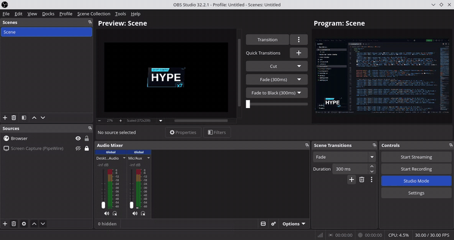
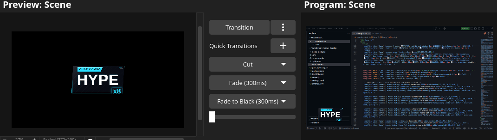
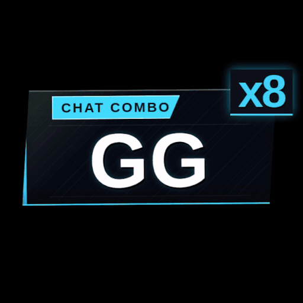
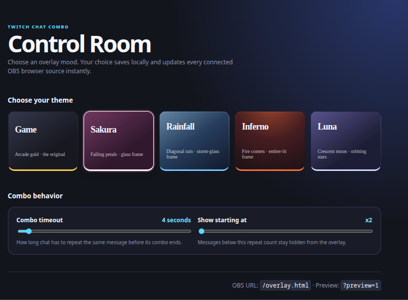

# Twitch Chat Combo Overlay

An OBS browser-source overlay that turns repeated Twitch chat messages into a punchy fighting-game-style combo counter. It runs locally, needs no database, and displays only the most recently repeated active message.

## Preview

### Square preview

### Control Room

## Quick start

1. Install Node.js 18 or newer.
2. In this folder, run `npm install`.
3. Copy `.env.example` to `.env` and set `TWITCH_CHANNEL` to the channel to watch.
4. Start it with `npm start`.
5. Open `http://localhost:3000/settings.html` to choose a theme, then open `http://localhost:3000/overlay.html` in a browser to test it.

Leaving `TWITCH_BOT_USERNAME` and `TWITCH_OAUTH_TOKEN` empty uses Twitch's anonymous read-only chat connection. To use a bot account, supply both values; OAuth tokens conventionally begin with `oauth:`. A token can be generated through Twitch's [Chat OAuth Token Generator](https://twitchapps.com/tmi/). Keep `.env` private and never commit it.

## OBS setup

Add a **Browser** source, set its URL to:

`http://localhost:3000/overlay.html`

Use the same dimensions as your scene (for example, 1920 × 1080). The page has a transparent background. OBS and the Node server should run on the same computer; by default, the app listens only on that computer to keep the Control Room and chat events private.

## Configuration

| Variable | Default | Purpose |
| --- | --- | --- |
| `TWITCH_CHANNEL` | required | Channel name without `#`. |
| `TWITCH_BOT_USERNAME` | empty | Optional authenticated bot username. |
| `TWITCH_OAUTH_TOKEN` | empty | Optional bot OAuth token. |
| `PORT` | `3000` | Local web server port. |
| `HOST` | `127.0.0.1` | Loopback address used to keep the app private to this computer. |
| `COMBO_TIMEOUT_MS` | `6500` | Time window in milliseconds before a repeat chain expires. |
| `MIN_COMBO_COUNT` | `2` | First count sent to the overlay. |

To preview a different fade time in the browser source only, append `?timeout=6000` to its URL. Normally this should match `COMBO_TIMEOUT_MS`.

To preview the overlay design without Twitch chat, temporarily set the OBS source URL to `http://localhost:3000/overlay.html?preview=1`. It will play a repeating sample combo. Remove `?preview=1` before going live.

## Control Room and themes

Open `http://localhost:3000/settings.html` in a normal browser to use the local Control Room. It offers five live-switching themes:

- **Game** — arcade gold, the default.
- **Sakura** — a glass frame with drifting cherry-blossom petals.
- **Tsunami** — a waterline frame with animated curling waves.
- **Inferno** — a jagged charred frame with rising flame shards.
- **Luna** — a rounded midnight frame with a crescent moon and twinkling stars.

Picking a theme saves it in a local `settings.json` file and immediately updates any open OBS overlay sources. That file, along with `.env` and `node_modules`, is excluded from Git so channel credentials and local preferences are never published.

## Tuning and behavior

Messages are compared after trimming their outer whitespace and converting to lowercase. `Pog`, `POG`, and ` pog ` therefore combine, while different punctuation remains distinct. Edit `normalizeMessage()` in `server.js` to change matching rules.

Native Twitch emotes are rendered as their actual emote images in the overlay. Third-party emotes (such as BetterTTV or 7TV) are not supplied through standard Twitch chat tags, so they display as their text names unless you add a third-party emote integration.

Each message has its own short-lived combo record. When a repeat reaches `MIN_COMBO_COUNT`, the server sends an event to the overlay; the newest event is the one shown. Expired records are removed automatically.

Customize the visual palette, fonts, sizes, and placement through the CSS variables at the top of `overlay.html`. Edit `intensityFor()` there to change the x5, x10, x25, and x50 milestone effects.

## Development note

This project was built with the help of AI-assisted tools and is shared as an experimental, “vibecoded” project. Please review the code before using it in your own setup, and feel free to fork, adapt, or ignore it as you prefer.

## Security notes

The app binds to `127.0.0.1` by default, so the overlay, Control Room, and WebSocket are not reachable from other devices on the network. It accepts WebSocket connections only from local browser-source origins when an origin is supplied. Anonymous Twitch chat access is supported and is the safest default; if you use a bot OAuth token, use a dedicated read-only bot account, keep the token in `.env`, and never commit or share that file.
